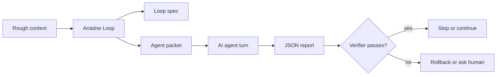

# Ariadne Loop

[](LICENSE)
[](pyproject.toml)

Write the thread your AI agent can follow.

Ariadne Loop turns messy project notes, issue context, or an active coding-agent thread into a verifiable Loop Engineering spec: goal, state, cycle, verifiers, stop rules, rollback, budget, supervision rules, and a JSON report contract.

It is not a prompt template library. It is a small loop-writing workbench for people who want agents to keep working without losing the evidence trail.



## Why It Exists

Loop Engineering is the move from one-off prompts to systems that repeatedly inspect, act, verify, and decide. The hard part is not making the prompt longer. The hard part is writing down:

- what the agent is allowed to change,
- what external evidence proves progress,
- when the loop must stop,
- how failed work is rolled back,
- when a human must approve the next step,
- what the agent must report after every turn.

Ariadne Loop generates that contract from a rough snapshot, validates the loop, validates the agent report, and can supervise a stream of agent reports to decide whether the loop should continue, stop, rollback, or ask for a human.

## Install

```bash
python -m pip install git+https://github.com/zhangzeyu99-web/ariadne-loop.git
```

From a checkout:

```bash
python -m pip install -e .
ariadne-loop --version
```

The old `loops-assistant` command is kept as a compatibility alias.

Install the Codex skill:

```bash
python3 ~/.codex/skills/.system/skill-installer/scripts/install-skill-from-github.py \
  --repo zhangzeyu99-web/ariadne-loop \
  --path skills/ariadne-loop \
  --name ariadne-loop
```

## Quick Start

Try the browser builder first: [Ariadne Loop Builder](https://zhangzeyu99-web.github.io/ariadne-loop/playground.html).

Create a starter snapshot:

```bash
ariadne-loop init --preset release --output loop-snapshot.json
```

Edit `loop-snapshot.json`, then generate a human-readable loop-writing report:

```bash
ariadne-loop write \
  --input loop-snapshot.json \
  --output loop-report.md \
  --format markdown
```

Try an included example:

```bash
ariadne-loop write \
  --input examples/release-readiness-snapshot.json \
  --output examples/generated/release-readiness-loop-report.md \
  --format markdown
```

Generate a machine-readable loop spec:

```bash
ariadne-loop make \
  --input examples/release-readiness-snapshot.json \
  --output examples/generated/release-readiness-loop.json \
  --format json
```

Generate an AI-ready packet:

```bash
ariadne-loop make \
  --input examples/release-readiness-snapshot.json \
  --output examples/generated/release-readiness-agent-packet.md \
  --format markdown
```

Validate the loop:

```bash
ariadne-loop check --input examples/generated/release-readiness-loop.json
```

Validate an agent report:

```bash
ariadne-loop report --input examples/agent-report.valid.json
```

Supervise a running loop from JSONL agent reports:

```bash
ariadne-loop supervise \
  --loop examples/generated/openclaw-loop.json \
  --reports examples/openclaw-reports.jsonl \
  --output examples/generated/openclaw-decision.json
```

## Input Snapshot

Use JSON for serious work because it makes verifiers and constraints explicit.

```json
{
  "title": "Release readiness loop",
  "goal": "Prepare a public release without shipping broken docs or stale examples",
  "current_state": "Core tests pass, README needs final examples and release notes",
  "recent_progress": ["pytest passed", "CLI smoke test passed"],
  "constraints": ["Do not publish until generated examples are committed"],
  "verifiers": ["pytest", "README quick start works", "generated examples validate"],
  "external_effects": ["git tag", "GitHub release"],
  "risk": "medium"
}
```

Markdown input also works for quick notes, but JSON is easier to validate and repeat.

Starter presets are available for common cases:

```bash
ariadne-loop init --preset bugfix --output bugfix-loop.json
ariadne-loop init --preset release --output release-loop.json
ariadne-loop init --preset refactor --output refactor-loop.json
ariadne-loop init --preset agent-handoff --output handoff-loop.json
```

You can also turn a GitHub issue body into the same snapshot shape:

```bash
ariadne-loop from-issue \
  --title "Fix stale generated examples" \
  --body-file issue.md \
  --output issue-loop.json
```

## What Ariadne Writes

A valid loop includes:

- `inspect -> act -> verify -> decide` cycle,
- observable verifiers,
- stop rules,
- rollback behavior,
- human gates for external-impact actions,
- budget limits,
- a strict agent report contract.

Agent reports must be JSON:

```json
{
  "action_id": "verify",
  "status": "continue",
  "evidence": ["pytest passed", "README quick start generated expected files"],
  "next_step": "prepare release notes",
  "passed_verifiers": ["gate-1"],
  "failed_verifiers": []
}
```

## Supervision Decisions

`ariadne-loop supervise` reads a loop JSON file and a JSONL stream of agent reports, then outputs a supervision decision:

- `continue`: keep working.
- `stop`: budget is exhausted or all verifiers have passed.
- `rollback`: the same verifier keeps failing.
- `needs_human`: the agent asks for help, the next step touches external-impact actions, or the loop is invalid.

Ariadne Loop does not execute external actions. It only makes the decision explicit so a human or outer harness can take the next step.

## Good Use Cases

- Turn a messy GitHub issue into an agent-executable repair loop.
- Convert a long Codex or Claude Code thread into a resumable work contract.
- Write release loops with explicit verification and rollback gates.
- Create repeatable refactor loops for large codebases.
- Teach contributors what evidence a task needs before it counts as done.

## Bad Use Cases

- Fully autonomous changes with no verifier.
- One-shot creative writing prompts.
- Tasks where success cannot be observed or read back.
- Work that needs hidden credentials, private data, or unbounded spending.

## Example Outputs

- [Release readiness loop report](examples/generated/release-readiness-loop-report.md)
- [Browser loop builder](https://zhangzeyu99-web.github.io/ariadne-loop/playground.html)
- [OpenClaw agent packet](examples/generated/openclaw-agent-packet.md)
- [Coding agent workflow](docs/coding-agent-workflow.md)
- [Verifier recipes](docs/verifier-recipes.md)
- [Reference patterns](docs/reference-patterns.md)
- [Use-case gallery](docs/use-cases.md)
- [Loop spec anatomy](docs/loop-spec.md)

## Development

```bash
python -m pip install -e .
python -m pytest -q
python -m compileall loops_assistant
ariadne-loop make --input examples/openclaw-snapshot.json --output examples/generated/openclaw-loop.json --format json
ariadne-loop supervise --loop examples/generated/openclaw-loop.json --reports examples/openclaw-reports.jsonl --output examples/generated/openclaw-decision.json
```

## Contributing

The best first contributions are practical examples:

- a real loop snapshot from a coding-agent workflow,
- a verifier pattern for a common toolchain,
- a new input adapter,
- docs showing how a loop failed and how it was tightened.

See [CONTRIBUTING.md](CONTRIBUTING.md).

## Background

The name comes from Ariadne's thread: a simple line through a complicated maze. That is what a good loop should be for an AI agent.

For the current discussion around Loop Engineering, start with Addy Osmani's [Loop Engineering](https://addyosmani.com/blog/loop-engineering/) essay.
